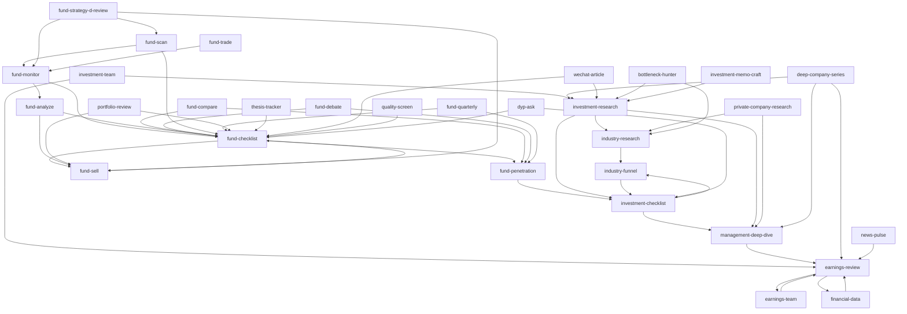

# SKILL 依赖图与触发场景

> 自动生成自 `scripts/gen-skill-graph.py`。修改 `DEP_HINTS` 字典后重跑。

## 依赖关系总览

## 典型触发场景

> 📖 **AI 工作流**: 触发后, AI 读 `docs/AI_DATA_GUIDE.md` 找数据, 然后按 SKILL 步骤执行。

> 💡 **开局 Prompt**: 复制 `docs/AI_AUDIT_PROMPT.md` 到 IDE 的 system prompt。

### 📊 每日 14:30 实盘

- **触发**: GitHub Actions 14:30 自动
- **链路**: `daily_live.py` → 抓取数据 → 五维评分 → 生成 `reports/sim/YYYY-MM-DD.md`
- **用户动作**: 打开日报，AI 自动读取 `AI 审计入口` 区块 → 调用 `fund-checklist` / `fund-sell`

### 🆕 看到大佬新买入一只基金

- **触发**: 用户问 `“蓝鲸跃财今天买了什么”`
- **调用链**: `fund-monitor` → 输出新买入清单 → `fund-checklist {code}` → 必要时 `fund-penetration {code}`

### 💰 持仓要不要卖

- **触发**: 用户问 `“我这只基金该不该卖”`
- **调用链**: `fund-sell {code}` → 读 `fund-monitor` 输出 → `fund-checklist` (复查买入逻辑是否还成立)

### 🔍 主动找新机会

- **触发**: 用户问 `“帮我扫一下最近的好基金”`
- **调用链**: `fund-scan` → 多维度筛选 → `fund-checklist` 深度审计 → `fund-penetration` 穿透

### 📈 行业/主题研究

- **触发**: 用户问 `“半导体现在能买吗”`
- **调用链**: `industry-funnel` → 选股 → `industry-research` 行业 → `investment-checklist` 单只 → 必要时 `management-deep-dive`

### 📰 季报 / 新闻

- **触发**: 用户问 `“腾讯 Q2 财报怎么样”`
- **调用链**: `earnings-review` → `earnings-team` (团队视角) → `financial-data` (三表)

### ✍️ 写文章 / 备忘

- **触发**: 用户说 `“写一篇关于 XX 的公众号文章”`
- **调用链**: `investment-research` 准备素材 → `wechat-article` 编排 → 输出 `articles/` 目录

## 单 SKILL 速查表

| SKILL | 一句话 | 触发短语 | 依赖 |
|-------|--------|----------|------|
| `bottleneck-hunter` | 供应链瓶颈猎手：AI驱动的全球产业链瓶颈套利 | - | industry-research, investment-research |
| `deep-company-series` | 深度公司系列：8 篇长文拆一家公司 | - | investment-research, earnings-review, management-deep-dive |
| `dyp-ask` | 段永平问答：以他的方式思考 | - | fund-checklist, investment-checklist |
| `earnings-review` | 财报精读：一手资料深度解读 | - | earnings-team, financial-data |
| `earnings-team` | 财报精读团队：四大师并行解读 + 公众号发布 | - | earnings-review |
| `financial-data` | 财务数据获取与交叉验证规范 | - | earnings-review |
| `fund-analyze` | 基金评分解读 | - | fund-checklist, fund-sell |
| `fund-checklist` | 场外基金买入前 Checklist | - | fund-penetration, fund-sell |
| `fund-compare` | 基金对比分析 | - | fund-checklist, fund-penetration |
| `fund-debate` | 基金多视角辩论 | - | fund-checklist, fund-penetration |
| `fund-monitor` | 场外基金大佬持仓监控 | - | fund-checklist, fund-analyze |
| `fund-penetration` | 场外基金持仓穿透分析 | - | investment-checklist |
| `fund-quarterly` | 场外基金季度持仓变化追踪 | - | fund-checklist, fund-penetration |
| `fund-scan` | 基金全流程扫描 | - | fund-monitor, fund-checklist |
| `fund-sell` | 场外基金卖出决策 | - | fund-checklist |
| `fund-strategy-d-review` | 策略 D 季度检视 | - | fund-monitor, fund-sell, fund-scan |
| `fund-trade` | 今日基金交易建议 | - | fund-monitor |
| `industry-funnel` | 行业漏斗筛选：从全市场到 3 家的价值投资精选流程 | - | investment-checklist |
| `industry-research` | 行业投资研究：产业链全景扫描 + 四大师个股分析框架 | - | industry-funnel |
| `investment-checklist` | 巴菲特价值投资买入前 Checklist | - | management-deep-dive, industry-funnel |
| `investment-research` | 投资研究：巴菲特-芒格-段永平-李录 四大师综合分析框架 | - | investment-checklist, industry-research, management-deep-dive |
| `investment-team` | 投研团队：四角色并行分析框架 | - | investment-research, earnings-review |
| `management-deep-dive` | 管理层纵深研究：买股票就是买人 | - | earnings-review |
| `news-pulse` | 公司新闻脉搏：股价异动快速归因团队 | - | earnings-review |
| `portfolio-review` | 组合管理：从"研究公司"到"管理组合" | - | fund-sell, fund-checklist |
| `private-company-research` | 未上市公司研究：多Agent并行深度研究框架 | - | management-deep-dive, industry-research |
| `quality-screen` | 去劣筛选：7条指标快速排除非一流公司 | - | fund-checklist |
| `thesis-tracker` | 投资论文追踪：买入后的纪律系统 | - | fund-checklist |
| `wechat-article` | 微信公众号文章：作者-编辑-读者三Agent协作 | - | investment-research, fund-checklist |